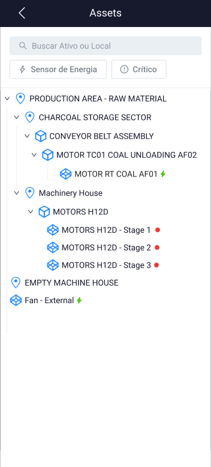
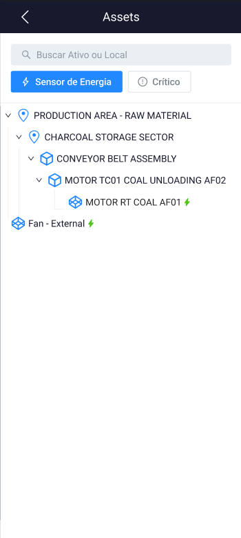
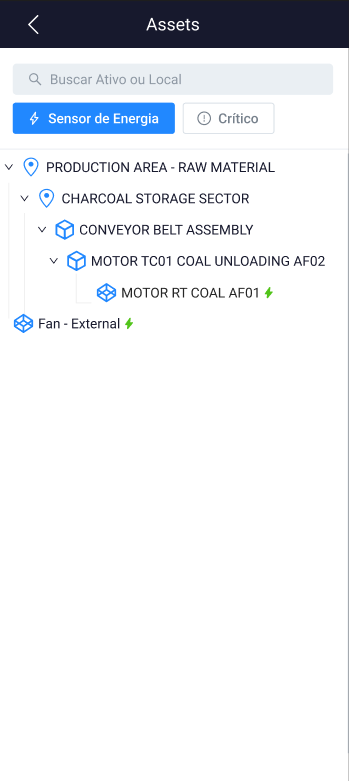
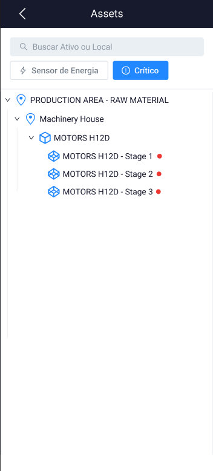
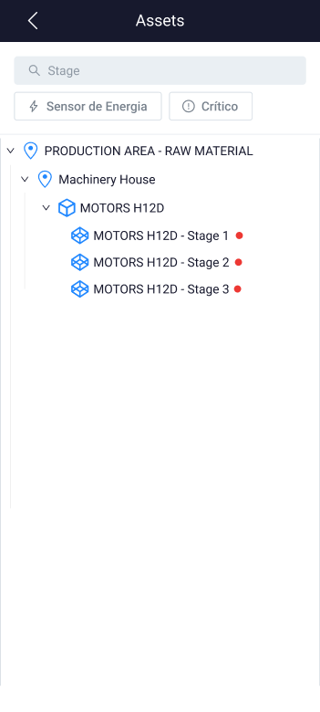

<h1 align="center">Project Documentation: Industrial Asset Tracker</h1>


## Description
The **Industrial Asset Tracker** is a Flutter application for managing and visualizing the hierarchy of industrial assets. It uses clean architecture and Bloc + Cubit for state management, and includes unit tests, widget tests, and integration tests.

### Technologies
<p display="inline-block">
  
  
</p>

### Screens

![Tela de Login](assets/prints/1.png







## Project Structure
```
**industrial_asset_tracker**
├── android
├── ios
├── lib
│   ├── core
│   │   ├── error
│   │   │   ├── exceptions.dart
│   │   │   └── failures.dart
│   │   ├── usecases
│   │   │   └── usecase.dart
│   │   └── utils
│   │       ├── constants.dart
│   │       └── input_converter.dart
│   ├── features
│   │   ├── asset_management
│   │   │   ├── data
│   │   │   │   ├── datasources
│   │   │   │   │   └── asset_remote_data_source.dart
│   │   │   │   ├── models
│   │   │   │   │   ├── asset_model.dart
│   │   │   │   │   ├── component_model.dart
│   │   │   │   │   └── location_model.dart
│   │   │   │   ├── repositories
│   │   │   │   │   └── asset_repository_impl.dart
│   │   │   ├── domain
│   │   │   │   ├── entities
│   │   │   │   │   ├── asset.dart
│   │   │   │   │   ├── component.dart
│   │   │   │   │   └── location.dart
│   │   │   │   ├── repositories
│   │   │   │   │   └── asset_repository.dart
│   │   │   │   └── usecases
│   │   │   │       ├── get_all_assets.dart
│   │   │   │       ├── get_asset_details.dart
│   │   │   │       ├── get_locations.dart
│   │   │   │       └── search_assets.dart
│   │   │   ├── presentation
│   │   │   │   ├── bloc
│   │   │   │   │   ├── asset_bloc.dart
│   │   │   │   │   ├── asset_event.dart
│   │   │   │   │   └── asset_state.dart
│   │   │   │   ├── cubit
│   │   │   │   │   ├── asset_cubit.dart
│   │   │   │   │   └── asset_state.dart
│   │   │   │   ├── pages
│   │   │   │   │   ├── asset_page.dart
│   │   │   │   │   ├── home_page.dart
│   │   │   │   │   └── splash_page.dart
│   │   │   │   └── widgets
│   │   │   │       ├── asset_tree_view.dart
│   │   │   │       ├── asset_widget.dart
│   │   │   │       ├── component_widget.dart
│   │   │   │       └── location_widget.dart
│   ├── injection_container.dart
│   └── main.dart
├── test
│   ├── core
│   │   └── utils
│   │       └── input_converter_test.dart
│   ├── features
│   │   ├── asset_management
│   │   │   ├── data
│   │   │   │   └── repositories
│   │   │   │       └── asset_repository_impl_test.dart
│   │   │   ├── domain
│   │   │   │   └── usecases
│   │   │   │       ├── get_all_assets_test.dart
│   │   │   │       ├── get_asset_details_test.dart
│   │   │   │       ├── get_locations_test.dart
│   │   │   │       └── search_assets_test.dart
│   │   │   ├── presentation
│   │   │   │   ├── bloc
│   │   │   │   │   ├── asset_bloc_test.dart
│   │   │   │   ├── cubit
│   │   │   │   │   ├── asset_cubit_test.dart
│   │   │   │   └── pages
│   │   │   │       └── asset_page_test.dart
│   ├── injection_container_test.dart
│   └── test_helper.dart
├── .gitignore
├── analysis_options.yaml
├── pubspec.yaml
└── README.md
```

### Features
 1. **Visualization**

  - Presents a dynamic tree structure displaying components, assets, and locations.

 2. **Filters**

 - Text Search: Allows users to search for specific components/assets/locations.
 - Energy Sensors: Implements a filter to isolate energy sensors in the tree.
 - Critical Sensor Status: Integrates a filter to identify assets with critical sensor status.

## Setup Instructions
 1. **Clone the repository:**
```
  git clone <REPOSITORY_URL>
```
 2. **Navigate to the project directory:**
```
  cd industrial_asset_tracker
```
 3. **Install dependencies:**
```
  flutter pub get
```
 4. **Run the application:**
```
  flutter run
```
## Testing

To run unit tests, widget tests, and integration tests, use the command:
```
  flutter test
```
## Future Improvements
 - Implement a more detailed and intuitive user interface.
 - Add drag-and-drop functionality in the asset tree.
 - Improve performance for large datasets.
 - Add user authentication and management.

## Code Examples
#### Asset Entity

```dart
// lib/features/asset_management/domain/entities/asset.dart

class Asset extends Equatable {
  final String id;
  final String name;
  final String? parentId;
  final String? locationId;

  Asset({
    required this.id,
    required this.name,
    this.parentId,
    this.locationId,
  });

  @override
  List<Object?> get props => [id, name, parentId, locationId];
}
```

#### Repository Implementation

```dart
// lib/features/asset_management/data/repositories/asset_repository_impl.dart

class AssetRepositoryImpl implements AssetRepository {
  final AssetRemoteDataSource remoteDataSource;

  AssetRepositoryImpl({required this.remoteDataSource});

  @override
  Future<Either<Failure, List<Asset>>> getAllAssets() async {
    try {
      final assets = await remoteDataSource.getAllAssets();
      return Right(assets);
    } on ServerException {
      return Left(ServerFailure());
    }
  }
}
```

#### Asset Bloc

```dart
// lib/features/asset_management/presentation/bloc/asset_bloc.dart

class AssetBloc extends Bloc<AssetEvent, AssetState> {
  final GetAllAssets getAllAssets;

  AssetBloc({required this.getAllAssets}) : super(Empty()) {
    on<GetAllAssetsEvent>((event, emit) async {
      emit(Loading());
      final failureOrAssets = await getAllAssets(NoParams());
      emit(failureOrAssets.fold(
        (failure) => Error(message: _mapFailureToMessage(failure)),
        (assets) => Loaded(assets: assets),
      ));
    });
  }
}

```

#### Project Diagram
